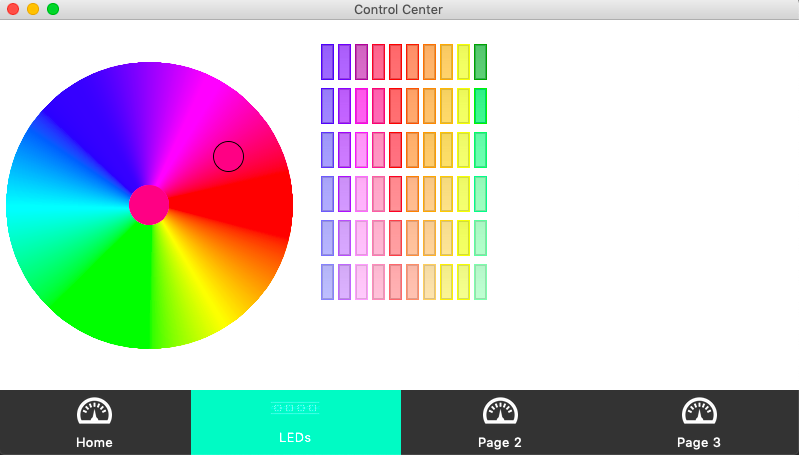
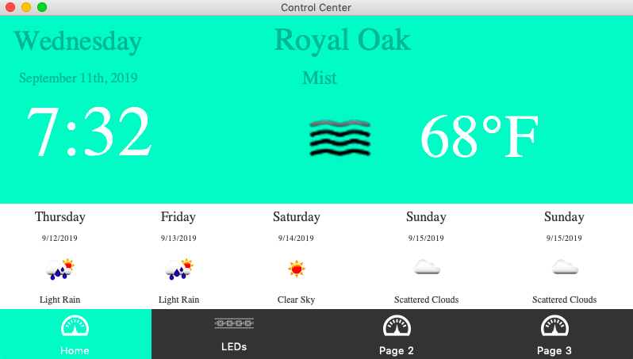

# TkinterLedControl
Controls for LED strip 

## Screen Shots
  

### Prerequisites
* Python 3.7

## Built With
* [Python](https://www.python.org/)
* [Tkinter](https://docs.python.org/3/library/tkinter.html) - Graphical User Interface
